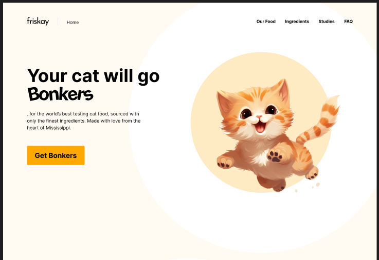
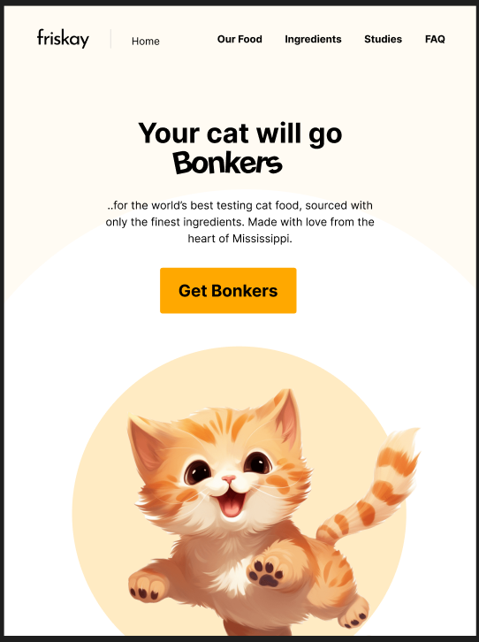
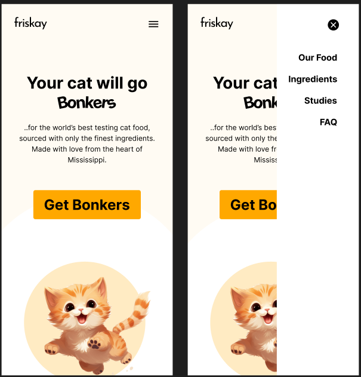

# Kitty Food Website

## ==> [🔥Live Demo]()

## Overview

A fully responsive and visually appealing website for a cat food brand, designed to work seamlessly across small, medium, and large devices. This project emphasizes modern design principles and adaptive layouts.

## Folder Structure

```
- .git
- reference-images
- src
   - images
   - index.js
   - main.css
- index.html
- README.md
```

## Features

- **Responsive Design**: The layout adjusts beautifully across all screen sizes.
- **Clean and Modern UI**: Sleek design to attract users.
- **Call-to-Action Button**: Encourages interaction with a vibrant, prominent button.
- **Navigation Menu**: Intuitive navigation across the website.

## Design Previews

### Large Device View



### Medium Device View



### Small Device View



## Tech Stack

- **HTML**: For structuring content.
- **CSS**: For styling and layout.
- **JavaScript**: For interactivity.

## Setup Instructions

1. Clone the repository:

   ```bash
   git clone <repository-url>
   ```

2. Navigate to the project directory:

   ```bash
   cd <project-folder>
   ```

3. Open `index.html` in your browser to view the website:

   ```bash
   open index.html
   ```

## Contribution Guidelines

1. Fork the repository.
2. Create a new branch:

   ```bash
   git checkout -b feature-name
   ```

3. Commit your changes:

   ```bash
   git commit -m "Description of changes"
   ```

4. Push to your branch:

   ```bash
   git push origin feature-name
   ```

5. Open a pull request.

## License

This project is licensed under the [MIT License](LICENSE).
